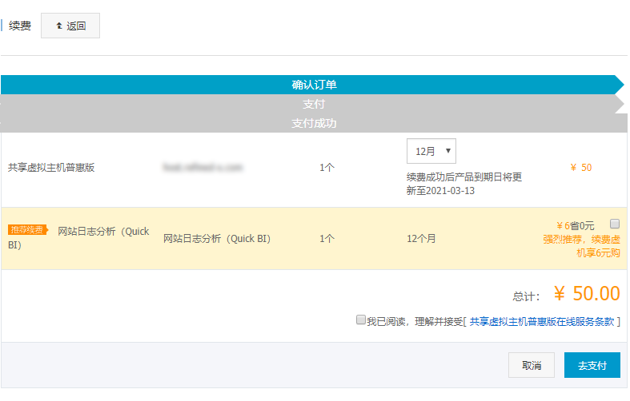
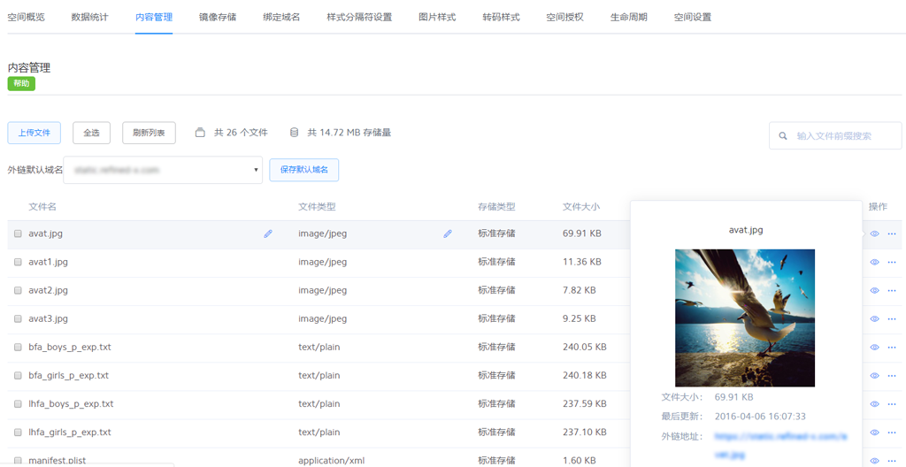
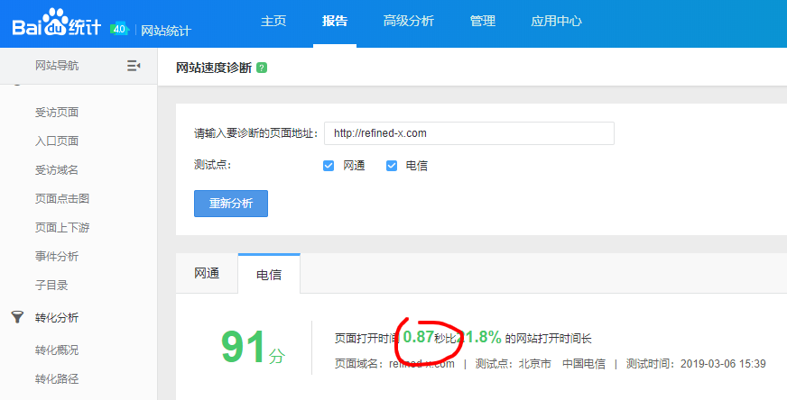
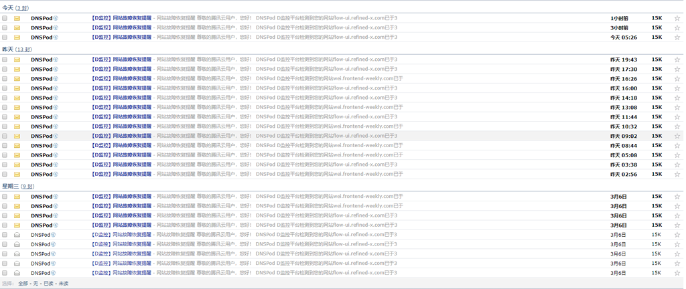
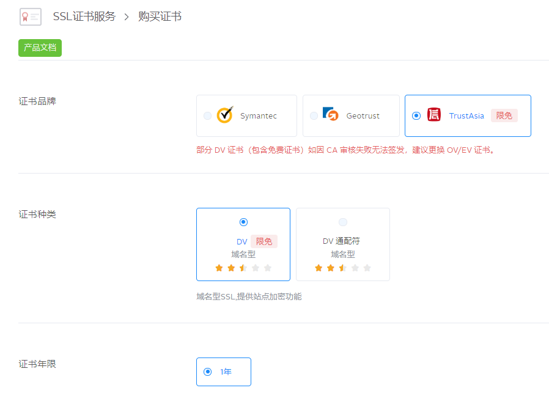
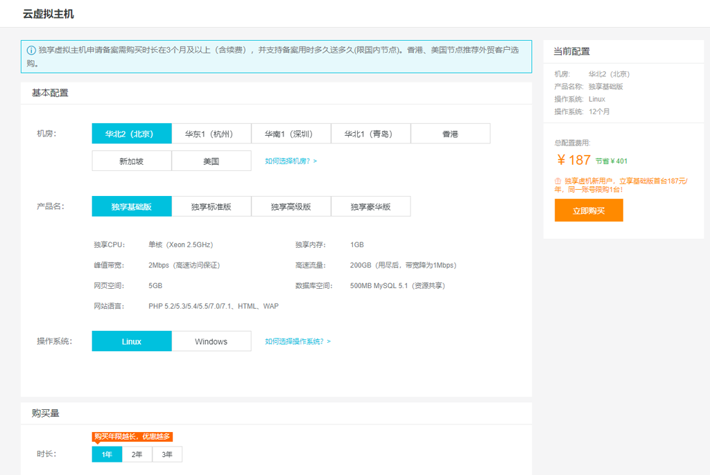

## 0元建站方案

### 空间 & 域名

建一个网站，无论动态站点还是静态站点，空间和域名都是必要条件，免费空间有两种方案：

1. Github Pages托管，将静态站点文件上传到GitHub，开启GitHub Pages服务即可，GitHub提供免费的`USERNAME.github.io`二级域名，也可以自己绑定域名。

- 优点：代码管理依托GitHub项目，站点的更新和发布非常方便；而且提供免费域名，不花一分钱就能让网站跑起来；
- 缺点：访问不稳定，非常频繁的出现无法访问，这个问题最好的解决方案是配置自定义域名，使用CDN加速，后面会讲到。

2. 七牛云·对象存储，实际上具有公共读权限的对象存储空间也可以看成一个静态文件服务器，七牛云的对象存储空间还可以设置空间默认主页和404页面，功能完备。

- 优点：自动接入七牛CDN服务，访问速度巨快；
- 缺点：代码管理需要采用传统文件管理的方式，对比差异，覆盖式上传，多少有点麻烦，适合不经常更新的站点（每个七牛存储空间提供一个月的免费测试域名，过期后需要绑定自己的域名）。

以上两种都是可以持久稳定提供服务的免费空间，虽然只能运行静态站点，但对于博客、演示项目类的站点来说足够了。比如[前端路上](https://refined-x.com/)就是用GitHub Pages托管，本地用[hexo](https://hexo.io/zh-cn/)生成站点，代码提交即部署，非常方便。

如果要搭建动态站点，比如一个WordPress站，那就必须拥有指定环境的服务器。目前最便宜的方案应该是[阿里云虚拟机](https://wanwang.aliyun.com/hosting/lightcloud-buy)，支持php环境+MySql数据库，前两年最便宜的虚机一年只需要50块钱左右，今年开始共享产品全部砍掉了，最便宜的独享配置187元/年。

不过事有两面，独享虚拟机的可用性确实更高了，相比动辄几百块一年的云服务器产品还是非常划算的。而且为了给云服务器产品让路，针对个人消费者的虚拟机在未来一定会越来越贵，趁低价产品下架前尽早买到，未来续费仍然享受低价，否则真等到要买的时候，可能选择余地就不大了。

【早两年买到的共享虚拟机，续费一年只需50】

### 对象存储

七牛云为每个用户提供10GB的免费对象存储空间，一个免费的云存储空间用处非常多：

- 图床。七牛云存储天然接入七牛CDN，访问速度又快又稳，将图片素材放在云端，既省流量又给站点提速；
- 测试接口。自己写一个json文件丢到空间上就能访问，关键时刻特别方便；
- 测试下载。同样的道理，有时候开发下载相关功能，直接将一个文件丢上去就能获得一个可下载文件地址，而且还能自定义文件MIME；

以上是我几乎天天都用的功能，即使不建站，也建议每个开发者都去[申请一个](https://portal.qiniu.com/signup?code=3ljfu83u7zu4y)。

七牛云存储的控制台提供非常好用的交互界面，轻度使用完全可以在控制台完成，但是如果存在大量文件需要对比的情况时，就需要使用官方的[上传工具（Windows）](https://github.com/qiniu/QSunSync)了，增量上传功能在文件量比较大的时候非常好用。

### CDN加速

七牛云为每个用户提供每月10GB的免费CDN流量，如果不了解CDN有什么用，一张图你就明白了：

[前端路上](https://refined-x.com/)博客用的hexo主题比较常见，经常能发现“撞衫”的。这个主题在响应式和SEO方面都做的不错，但是在代码精简和性能优化方面，做的只能说很一般，有非常多可以改进的地方，当然，这并不是作者能力问题，而是为了项目可维护性做出的必要牺牲。但就这样一个站点，做了CDN加速之后首页竟然能在1s内加载完！这种体验是代码层面的努力所不可能做到的。

CDN加速的除了给原站加速，另一个重要作用是提升站点的服务稳定性，这一点是针对GitHub Pages来说的。我有一个站点托管在GitHub Pages上，完全使用GitHub的服务，没有做加速，访问情况是这样的：

我每天收到十几封报警邮件，几乎每个小时站点都会挂一次，而即便能访问的时候，速度经常也是慢的一逼。同样托管在GitHub Pages上的博客，不光速度快，访问也从未出过问题，因为CDN只要缓存一次，用户就不会再从原站获取内容了，原站挂了也不影响服务。

除了七牛，好像还从没有其他云计算服务商提供免费CDN的。这个福利我印象中已经持续了至少三年，可以说是程序员专属福利了，个人博客或小项目每月10G的下行流量完全够用。

如果你有一个已备案的域名，再去领一个[免费CDN加速](https://portal.qiniu.com/signup?code=3ljfu83u7zu4y)，那就完美了。

### 免费SSL证书

`https`已经是大势所趋了，Chrome很早就已经对非`https`站点标记为不安全，而对`https`站点也没有额外酷炫的标记，仅仅是正常展示而已，`https`正在成为网站标配。

SSL证书是实现加密传输的关键，现在免费的SSL证书倒是很容易申请到，不过如果使用七牛的CDN服务的话，在七牛申请SSL证书会非常方便后续的域名绑定。即便不使用七牛的服务，在七牛申请的证书也可以下载，用在其他地方。

立刻去申请[免费SSL](https://portal.qiniu.com/signup?code=3ljfu83u7zu4y)证书吧。

## 我没有域名怎么办

要使用前面提到的很多优质免费服务，前提都是要有一个自己的域名，这对很多人来说可能是一个不大不小的门槛，因为买域名免不了要花钱，而且费用是按年收取的，这个全世界都一样，谁也逃不了。

在说域名注册之前，我们先说一下域名这个东西。在上个世纪末，域名投资可能是IT圈里最火的话题之一，因为域名具有跟黄金类似的属性：稀有。域名有多稀有呢？在`.com`域名一统天下的年代，任何一个域名都是**唯一**的。一个域名一旦被注册了，那么除了注册人之外，全世界所有人都不可能再得到这个域名。而一个域名的价值，可能体现在商业标识上，比如企业名号；或者体现在人尽皆知的流通性上，比如智联的域名`zhaopin.com`；或者仅仅是对个人而言的特殊价值，比如你的名字，你的生日，你的结婚纪念日等等，但无论哪种情况，域名在需求方具有非你莫属的特点，而在供应方却又随时面临被其他人抢先注册的风险，这就使域名产生了投资价值。

这里主要是为了告诉大家，花钱能买到自己心仪的域名绝对是一件有意义而且值得的事，并不是鼓励大家去投资域名。实际上今时今日，具有投资价值的`.com`域名早已被瓜分殆尽，同时其他后缀的域名也越来越多，除非遇到非常好的热点机遇，否则是不太容易淘到好域名的。

言归正传，下面要说的是，如何花**242块钱搞定一切**。

### 注册域名

很多人可能听说过，注册域名不要在国内，而要去GoDaddy或者其他国外域名服务商注册。这句话对也不对，完全看你这个域名将来想怎么用。如果你发现一个绝佳的域名，想养起来作为投资，那么你最好去GoDaddy注册，主要是因为国内服务商可以理解为小商品城里的搞批发的，他们并不真的拥有域名，卖给你的域名理论上随时可以因为不明不白的原因被收回，作为投资就太不安全了。而如果你这个域名是要在近期投入使用的，而且面向群体主要在国内，那么不用纠结，直接在国内注册，因为即便你在国外注册了，将来也得迁回来，否则你无法备案，也无法使用任何CDN/统计等一切国内的域名服务。

那么具体在哪儿注册呢？目前来说首选[腾讯云的域名注册服务](https://cloud.tencent.com/redirect.php?redirect=1009&cps_key=55b0d6026f97f5980bceec15fcefa0af&from=console)。

- 第一腾讯云便宜，首年55续费60，经常发代金券，续费可抵扣；
- 第二腾讯早年收购了DNSPod，注册域名可以自动使用DNSPod做域名解析，要知道DNSPod是国内最好的域名解析服务商，没有之一。

基于以上两点，腾讯云是注册域名的不二之选，`.com`域名首年55，领到代金券还能更便宜。

### 虚拟机&域名备案

有了域名还必须备案，否则仍然无法使用各种基础服务，这也是我们改变不了的现状，这里就不吐槽了。如果你身边没有能代办备案的网络公司，那么备案还真是挺麻烦的一件事，如果自己去跟管局打交道，来来回回几趟邮寄就能把你逼疯。

目前来说足不出户最简单的备案平台就是阿里云的[备案系统](https://beian.aliyun.com/order/index?spm=5176.8087400.600752.3.293715c9Bpq6vV)。首次备案需要买一块幕布，回家自己按要求拍照并回传；然后下载系统提供的域名备案核验单，打印出来签个名，手机拍照再提交到系统，整个备案只需要你做这些，期间大部分时间都在等待管局审核。（如果你的PS技术足够强，核验单也可以不打印，只要将自己的签名P上去再伪造成下载拍摄的样子，也有可能通过，别问怎么知道的）

那么如何使用阿里云备案系统呢，答案是买了阿里的云服务器，包括云虚拟机。现在明白为什么是242块钱了吧，前面说过目前最便宜的阿里云虚拟机187/年，加上买域名的55，正好242块钱。

而且一个虚机可以备案多个域名，简直神器，所以仅仅为了备案，买这个虚拟机也可以给我们省不少事，我当年就是专门为了备案买的。除了备案和虚拟机可以跑动态网站以外，其实虚拟机还可以这么用：

- 云函数。最近各大云服务厂商都有云函数服务，其实有了虚拟机，自己写一个php文件丢上去就是一个云函数啊，实现代理/爬虫/转发轻而易举
- 动态接口。对象存储只能做静态的json文件接口，虚拟机可以实现动态接口，比如做一个抓取bing每日壁纸的接口给自己用：`http://host.refined-x.com/bing.php 大家别滥用，否则我只能改url了`

唯一的遗憾是共享虚机产品停售了，现在只卖独享，最低187/年。所以，如果你觉得这187花得值，就去阿里云买一个，还是那句话，如果迟早要买，那就尽早买，赚个续费便宜。

虚拟机这个产品线是阿里收购万网时一块带过来的，也是阿里独有的，价格全网最低。不过如果考虑买云服务器的话，那么阿里和腾讯的活动搞的非常频繁，难说阿里云就一定比腾讯云便宜，到时候大家可以自己去比较一下。

[【阿里云活动入口】](https://promotion.aliyun.com/ntms/yunparter/invite.html?userCode=y31qmczl)

[【腾讯云活动入口】](https://cloud.tencent.com/redirect.php?redirect=1025&cps_key=55b0d6026f97f5980bceec15fcefa0af&from=console)

## 最后

如果有更优惠的方案，本文会第一时间更新。
