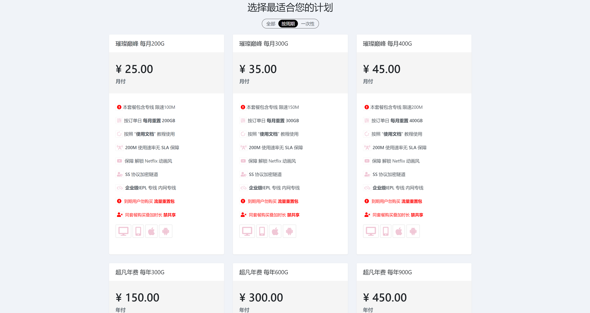

## 英文文档阅读套装

一个优秀程序员的成长过程中，读英文文档是迟早会遇到的槛，这个标志性的时刻往往出现在：

- 我们从学习资源的消费者转变成资源输出者的时候
- 或者在某个垂直业务领域走在同行的最前列的时候
- 或者我们发现国内最大的搜索引擎“百度”并不是那么好用的时候

这时我们需要更多、更深入的第一手学习资源，去突破成长路上的这层伪天花板，到达我们本该到达的、更广阔的天地。本文分享几个在个人学习过程中帮助很大的工具，希望也能助大家一臂之力。

### 解决怎么读的问题

首先，英文文档的阅读对于科班出身比例不高的程序员群体来说，是个普遍问题，我就经常从RSS列表中兴冲冲的打开一篇感兴趣的技术文章，然后发现是全英文的，那种败兴而归的感觉，别提了。

谷歌翻译是Chrome标配的翻译功能，不能说它不好用，但在现阶段中英翻译质量普遍不高的大环境下，谷歌翻译这种通篇替换的翻译方式，经常出现某一段话显然翻译错了，但又没有英文原文的对照，我们没办法自己去纠正理解这句话到底想表达什么。

《彩虹小译》是一款中英对照模式的网页翻译插件，完美解决了这个问题。遇到翻译不准确的段落，我们可以对照原文，利用自己有限的英文水平再去抢救一下，而不需要再全文翻回去查这句话到底是怎么说的，解决了英文文档阅读中的一个痛点。

[**下载彩虹小译**](https://chrome.google.com/webstore/detail/lingocloud-interpreter/jmpepeebcbihafjjadogphmbgiffiajh?utm_source=chrome-ntp-icon)

技术文档相比普通英文作品而言，充斥了大量了技术术语和专有名词，普通的翻译软件在翻译质量上始终难以达到理想的效果，这就不可避免的需要我们自己在阅读过程中具有一定的纠错能力，而这，再一次难倒了我。。。。

直到我发现了《划词翻译》这款Chrome插件，遇到不认识的单词，只要鼠标双击选中（或划词选中），旁边会立即出现翻译按钮，点击出翻译结果。这种方式可以最大限度的减少对阅读过程的干扰，维持“心流”状态，而且越是读难啃的文档体验就越好。

[**下载划词翻译**](https://github.com/Selection-Translator/crx-selection-translate)

### 解决读的到的问题

有些东西，当我们不需要的时候它仿佛不存在，而需要的时候，它还是“不存在”的。

国内的计算机基础科学氛围跟国外有差距，当我们想得到第一手的英文学习资料时，能读的到是一个很现实的问题。

- 最大的代码开源社区Github访问不稳定
- 最权威的Web技术文档资源站MDN访问不稳定
- 公认更好用的搜索引擎用不了
- 对于前端开发者来说，用上实时更新的Chrome可能是一件带有图腾意义的事
- 一定还有很多你想补充的

你知道我们需要什么，[**点这里，自己去拿**](https://portal.shadowsocks.center/aff.php?aff=19825)。

个人使用【入门版】就可以，速度那叫一个稳。

三年服务期最划算，不放心稳定性的可以先来一年的，我用了一年多，没问题。

配套工具都准备好了，傻瓜化。

免费工具找来找去，最终浪费的是自己的时间，[**不如花点小钱享受稳定的服务。**](https://portal.shadowsocks.center/aff.php?aff=19825)

## 最后

本文将不定期更新，祝你成功！